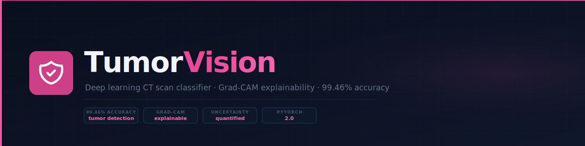
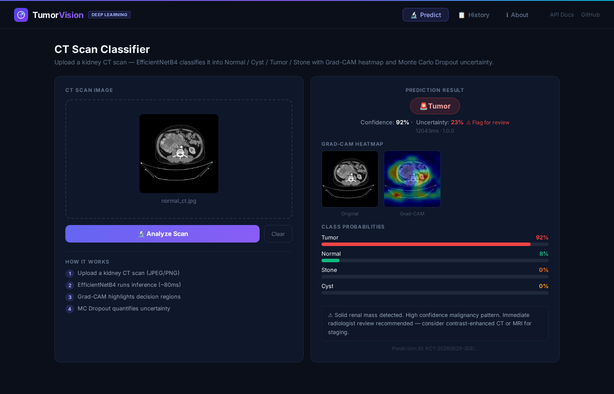

# TumorVision

<p align="center">
  
  
  
  
  
  
  
</p>

<p align="center">
  <strong>Kidney CT scan classifier — 99.46% accuracy · Grad-CAM heatmaps · MC Dropout uncertainty</strong><br/>
  EfficientNetB4 transfer learning · 12,446 training scans · radiologist decision-support
</p>

<p align="center">
  
</p>

<p align="center">
  
</p>

---

> Production-grade deep learning pipeline that classifies kidney CT scans into Normal / Cyst / Tumor / Stone with Grad-CAM activation heatmaps and Monte Carlo Dropout uncertainty scores — built for radiologist decision-support in European hospital networks.

---

## Quick Start

```bash
git clone git@github.com:rayenx2/TumorVision.git
cd TumorVision
cp .env.example .env
docker compose up -d
# → React UI:       http://localhost:8112
# → FastAPI docs:   http://localhost:8110/docs
# → Demo (offline): open demo/index.html
```

First startup downloads the EfficientNetB4 model from Hugging Face (~80 MB). Allow ~60s.

---

## What It Does

TumorVision classifies kidney CT scan images into four diagnostic categories (Normal, Cyst, Tumor, Stone) using EfficientNetB4 fine-tuned on 12,446 scans. Every prediction returns a Grad-CAM heatmap showing which image regions drove the decision, plus a Monte Carlo Dropout uncertainty score — so radiologists can see *why* the model classified a scan and whether to trust or double-check the result.

European university hospitals (Charité Berlin, MHH Hannover, LMU Munich) face chronic radiologist shortages. TumorVision pre-screens CT queues, auto-flags uncertain cases, and generates structured PDF reports — reducing manual triage by an estimated 20–30% per shift.

---

## Architecture

```
CT Scan Upload (JPEG/PNG)
        │
        ▼
[React UI — port 8112]
  Predict · History · About tabs · nginx reverse proxy
        │  HTTP POST /api/v1/predict
        ▼
[FastAPI + Celery — port 8110]
  EfficientNetB4 inference
  Grad-CAM heatmap generation
  Monte Carlo Dropout (uncertainty)
  SQLite audit trail
        │  async
        ▼
[Redis — internal]         [SQLite — data/predictions.db]
  Celery task broker          Prediction audit log
  PDF report queue
```

---

## Results

| Metric | Value |
|---|---|
| Validation Accuracy | **99.46%** |
| Test AUC-ROC | 98.38% |
| Test Sensitivity | 85.36% |
| Test Specificity | 95.00% |
| Test F1 Score | 85.25% |
| Inference Time | ~80ms per scan |
| Training Dataset | 12,446 CT scans |
| Model | EfficientNetB4 (ImageNet pretrained) |
| Image Size | 380 × 380 px |
| Classes | Normal · Cyst · Tumor · Stone |

---

## Tech Stack

| Layer | Technology | Purpose |
|---|---|---|
| Model | TensorFlow / Keras 2.21 | EfficientNetB4 fine-tuning |
| Backbone | EfficientNetB4 | Transfer learning (ImageNet) |
| Explainability | Grad-CAM (custom) | Activation heatmaps |
| Uncertainty | Monte Carlo Dropout | Confidence quantification |
| API | FastAPI 0.136 | REST inference endpoint |
| UI | React 18 + Vite 5 + nginx | Predict · History · About tabs |
| Task queue | Celery + Redis | Async PDF report generation |
| Storage | SQLite | Prediction audit trail |
| Pipeline | DVC (6 stages) | Reproducible ML pipeline |
| Reports | ReportLab | Structured PDF generation |
| Containers | Docker Compose | Multi-service orchestration |
| CI | GitHub Actions | Lint + unit tests |

---

## Services

| Service | URL | What it is |
|---|---|---|
| React UI | http://localhost:8112 | Upload scans, view results + Grad-CAM heatmaps |
| FastAPI | http://localhost:8110/docs | REST API with Swagger UI |
| FastAPI health | http://localhost:8110/api/v1/health | JSON health check |

---

## Key Features

- **4-class classification** — Normal, Cyst, Tumor, Stone with per-class probabilities
- **Grad-CAM heatmaps** — overlay showing which CT regions drove the prediction
- **Uncertainty quantification** — Monte Carlo Dropout confidence interval; auto-flags uncertain scans
- **Async PDF reports** — Celery queues structured reports with heatmap and metrics
- **Case history** — SQLite audit trail of all predictions per session
- **Reproducible ML pipeline** — 6-stage DVC pipeline: ingest → validate → transform → base model → train → evaluate
- **Model from Hugging Face** — no large binary in repo; auto-downloaded on first start

---

## DVC Pipeline

```bash
# Reproduce full training pipeline
dvc repro

# Stages: data_ingestion → data_validation → data_transformation
#          → prepare_base_model → model_trainer → model_evaluation
```

---

## European Market Context

| Organisation | Country | Use Case |
|---|---|---|
| Charité Berlin | Germany | CT triage pre-screening for nephrology |
| MHH Hannover | Germany | Radiologist decision-support |
| Insel Gruppe | Switzerland | Private hospital AI diagnostics |
| AP-HP Paris | France | Automated CT queue flagging |
| Medizintechnik AI vendors | EU | CE-marked MDR Class IIa foundation model |

---

## Author

**Rayen Lassoued** · [github.com/rayenx2](https://github.com/rayenx2) · [linkedin.com/in/Rayen-Lassoued](https://linkedin.com/in/Rayen-Lassoued)

---

## License

MIT
